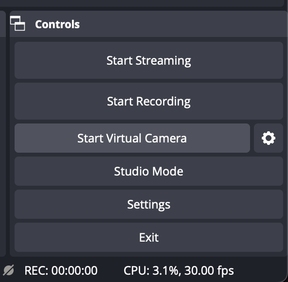
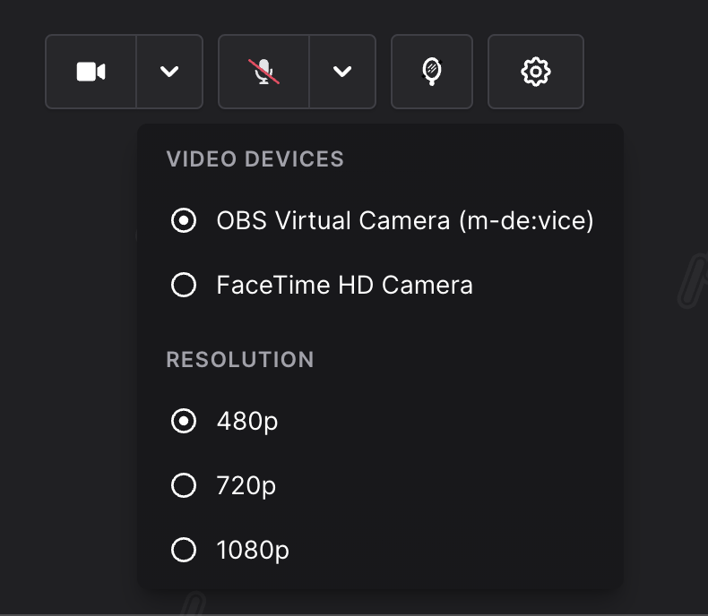
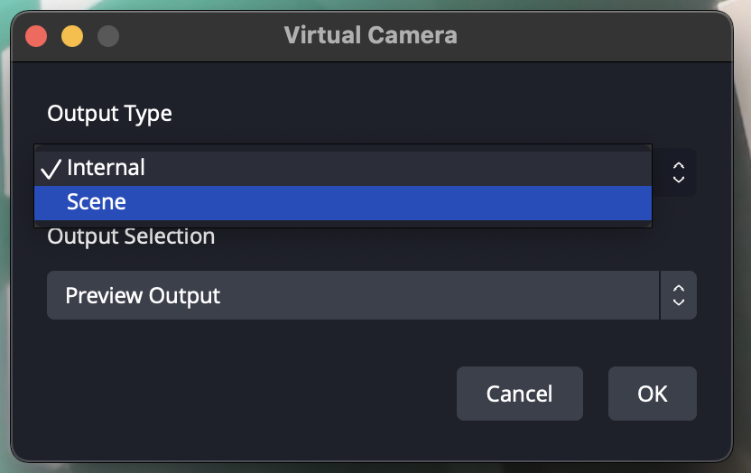

# OBS Virtual Camera

OBS's built in Virtual Camera is a super powerful feature. OBS version 26 introduced Virtual Cam as a built-in feature. OBS version 28 overhauled the control you have with it.

## Why Do I Need A Virtual Cam?

There are **two reasons** you might need a virtual camera

1. **Multi-Program Windows Camera Problem™️: your camera crashes** when used in two programs at once (like OBS and Ping/Discord/VDO Ninja)
2. You **want to use OBS as "webcam" in another app** (Ping.gg, Discord, VDO Ninja, etc)

OBS Virtual Camera is **ONLY USEFUL OUTSIDE OF OBS**. That's the point though - you can bridge the magic of OBS into other programs (like Ping!)

## Okay...What Do I Use It For?

We're going to talk about **TWO** common use cases - **Return Feed** and **Cam Out (OBS v28 only)**

### Return Feed

This is the default - you send out whatever OBS has in it. Great for producing shows w/ your camera taken by OBS, and Virtual Camera used to send it to Ping (or Discord, Zoom, VDO etc). **NOT IDEAL** if you're a GUEST on someone else's show.

Directly between the "Recording" and "Studio Mode" buttons, you can click "Start Virtual Cam" to send out your main OBS feed as a camera. Whatever you see in the main preview in OBS is now sent out as a camera

Now when you use programs like Ping, you should see "OBS Virtual Cam" as an option

### Camera/Scene Out (OBS v28+)

By default, OBS Virtual Cam sends out your _main feed_. As of version 28, you can send out any scene. This is **SUPER USEFUL** if you're a guest on another show and you're dealing with the **Multi-Program Windows Camera Problem™️**

:::tip

If you make a separate, full-screen camera scene and [use it as a **scene source**](/advanced-obs/nesting-scenes), you can set that scene as a virtual cam! (trust us this makes things so much simpler)
:::

1. Click the Settings cog next to the "Start Virtual Cam" button
2. Change "Output Type" from "Internal" to "Scene"
3. Select the scene you want to send out!

