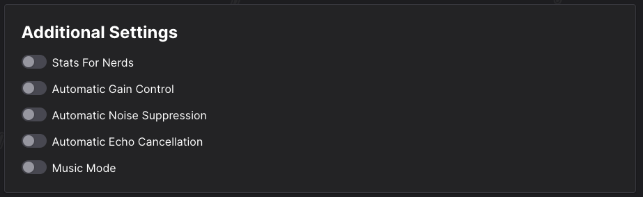

# Send GoXLR Desktop Audio through Ping

- In Ping, make sure you’re using the “Chat Mic” output from GoXLR

- In the GoXLR Routing Table, make sure that System Audio is ticked on in the Chat Mic Section

- In Ping, go to your dashboard and click on options under your room

- Then on the left side, go to Experimental

- And make sure to turn off Automatic Gain Control, Automatic Noise Supression, and Automatic Echo Cancellation.

- Side note, if your guests can hear themselves in the playback, make sure that whatever you’re using to hear them (Discord or Google Chrome) is being sent to “Chat” in Windows
  - You can get there by Right Clicking the Volume Icon in the bottom right of the system tray, then going to Sound Settings, then going to “App volume and device preferences”

