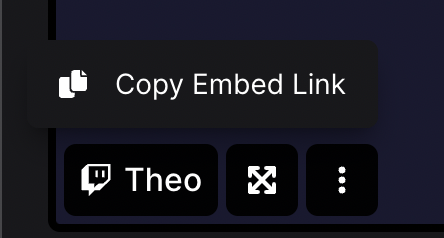
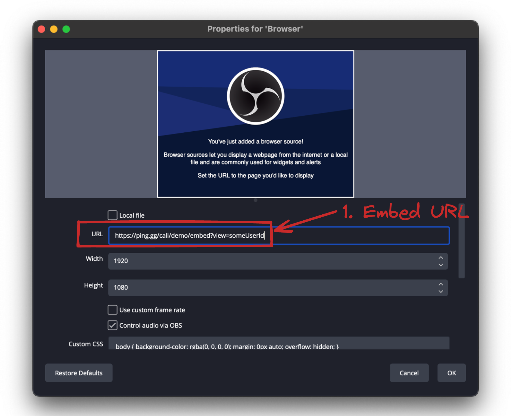
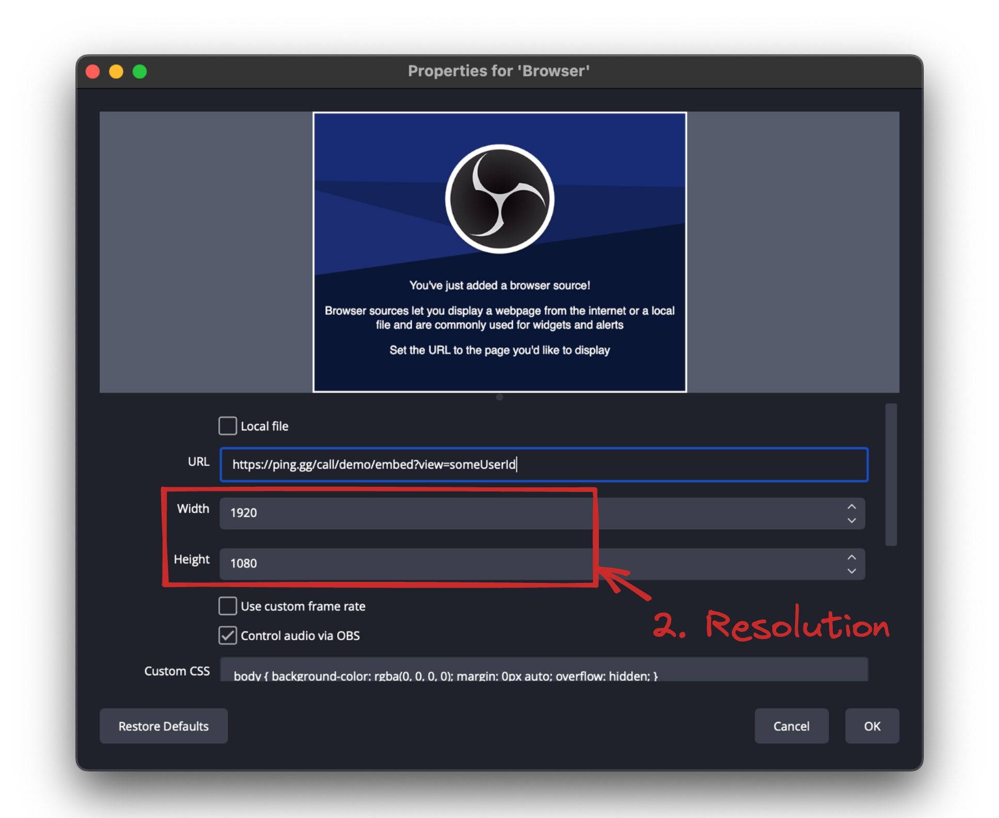
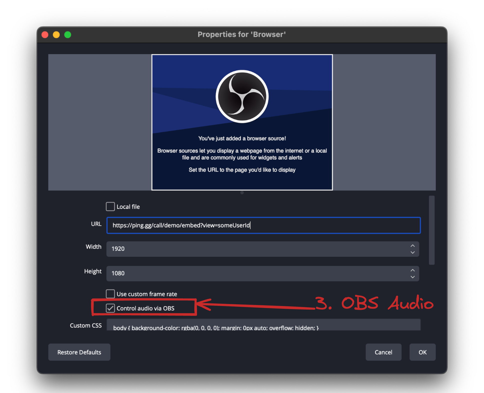

# Getting Started

Ping.gg is the best way to make collab video. Live on Twitch, recorded for Youtube, produced for television, and everything in between.

If you prefer videos, Theo and Adam filmed one below to help you get started quick! Otherwise you can follow along below

<div style={{ width: "100%", display: "flex", justifyContent: "center" }}><iframe width="560" height="315" src="https://www.youtube.com/embed/inSIW-m2Oq0" title="Ping.gg Tutorial" frameborder="0" allow="accelerometer; autoplay; clipboard-write; encrypted-media; gyroscope; picture-in-picture; fullscreen" allowfullscreen></iframe></div>

## Ping.gg Room Setup

### Create your room

To get started, [sign up for your trial on Ping](https://ping.gg/pricing)

The URL you choose during setup is the URL you'll be sending to guests to join your call - will look like:

```
https://ping.gg/call/demo
```

...where `demo` would be replaced with the slug you pick during sign-up.

### Invite a guest

Send the URL you created above to a guest for them to request to join. Whenever a guest tries to join, they will go through three steps:

1. Sign in with Twitch, Twitter or Google.
2. Select camera and microphone devices
3. Click "Request To Join"

When the guest clicks "Request To Join", you will see their request inside of the call in the top right. When you "accept" them, they will join the call

### Copy Embed link



When you hover over a video preview in the call, a menu button will appear. Click it and you will have the option to "copy embed link".

This link should be used in a browser source in your streaming software of choice - more below!

## Streaming Software Setup

Ping is compatible with _any video software that can treat a website URL as a "source"_ (i.e. a [_browser source_](https://obsproject.com/eu/kb/browser-source)). This includes:

- [OBS Studio (Open Broadcaster Software Studio)](https://obsproject.com/)
- [Streamlabs Desktop](https://streamlabs.com/)
- [XSplit](https://www.xsplit.com/)
- [Twitch Studio](https://www.twitch.tv/broadcast/studio)

While all of these solutions work, we **highly recommend that you use [OBS](https://obsproject.com/)**.

## Browser Sources

:::tip

Using **[nested scenes for your Ping browser sources](/advanced-obs/scene-as-source)** can make things much simpler with complex setups
:::

To get Ping into OBS, first create a [Browser Source](https://obsproject.com/eu/kb/browser-source) (+ button in "sources" -> "Browser").

Once you have the browser source customizer window open, you have to change **THREE THINGS**.

### 1. Add the Embed URL

Paste the embed URL from a guest as shown above. These URLs are static and don't need to be changed after a call ends



### 2. Change the resolution to 1920x1080

Even if your guest is using a different resolution, we recommend using 1920 width and 1080 height here to guarantee the simplest scaling and resizing at a 16:9 aspect ration



### 3. Enable audio control in OBS

In order to have control of the audio from your browser source, you _**have to enable this checkbox**_



## Now Go Live!

That's it! If this was helpful in getting started, please [shout us out on Twitter](https://twitter.com/pingdotgg) - also don't hesitate to [join our Discord](https://discord.gg/pinglabs) if you have any questions or want to chat with us.
